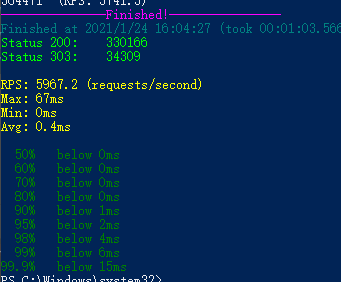

### HttpServer RPS对比

#### 1. 首先是单线程的HttpServer, 用SuperBenchmark测试结果如下

> 可以看出性能RPS 在47 左右

#### 1.2 为每次请求建立一个线程

> 为每一个请求创建一个线程在开始时,很快.但最终线程过多导致OOM
> 
> 
> 所以 这种方式是不可取的

#### 1.3 建立一个线程池

> 可以明显发现用了线程池的服务器,RPS 提升了很多
> 
> 这是JDK8 的,下面试试JDK 15
> 
> 
> 好像没多少提升
>