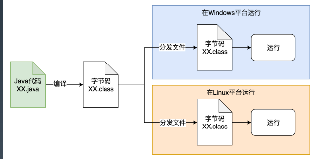
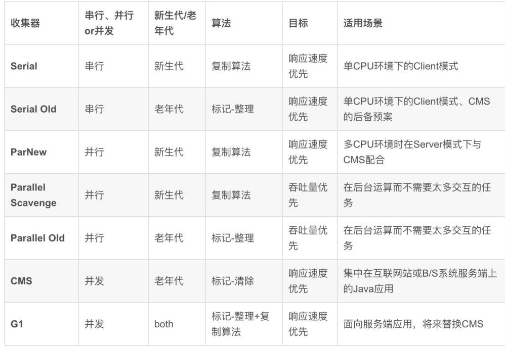
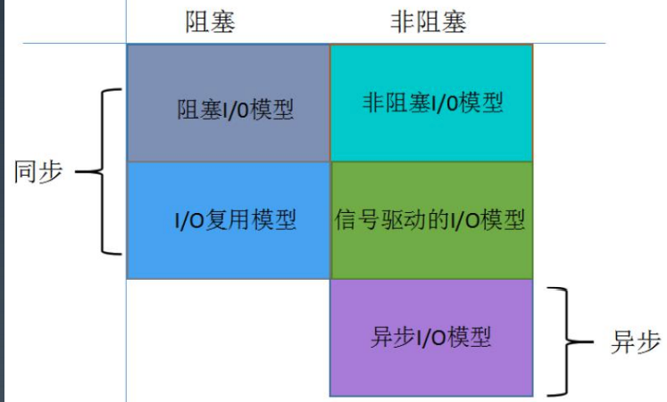
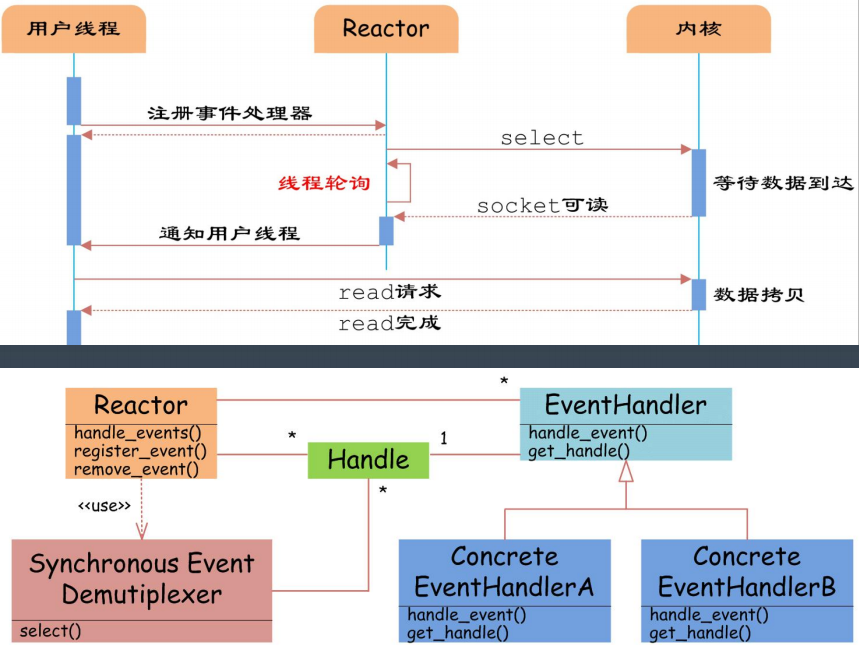
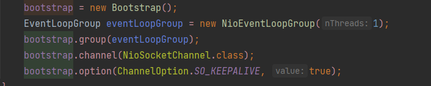

## 课程总结
### 1. JVM

### 1.1 JAVA与 JVM 的关系

> 从Java 语言来说, Java 是一种面向对象、静态类型、编译执行，
> 有 VM/GC 和运行时、跨平台的高级语言。,所以运行就必须要有JVM来进行运行,以下是java源代码怎样在JVM上运行的
> 
### 1.2 JMM(Java Memory Model)
>
> JMM是JVM里非常重要的点,只有搞明白才能掌握JVM.
>
> 以下是JMM的重点:

- CPU 乱序执行 
- volatile 关键字
-  原子性操作 
- 内存屏障

### 1.3  JVM检测工具

>在开发或线上运行时,我们要熟悉性能检测工具,常用的检测工具如下
>
>jstat*, jmap, jstack,jcmd
>
>另外还有图形化工具
>
>jconsole, jvisualvm, jmc. .其中jmc还有飞行记录器功能.
>
>jvisualvm 的插件VisualGC,可以去插件中心下载

#### 1.3.1 内存分析工具

- Eclipse MAT
- jhat

### 1.4 JVM的GC

#### 1.4.1 GC的背景与一般原理

#### 1.4.2 Java 目前支持的所有 GC 算法

1. 串行 GC（Serial GC）: 单线程执行，应用需要暂停； 
2. 并行 GC（ParNew、Parallel Scavenge、Parallel Old）: 多线程并行地执行垃圾回收， 关注与高吞吐；
3. CMS（Concurrent Mark-Sweep）: 多线程并发标记和清除，关注与降低延迟；

4. G1（G First）: 通过划分多个内存区域做增量整理和回收，进一步降低延迟； 
5. ZGC（Z Garbage Collector）: 通过着色指针和读屏障，实现几乎全部的并发执行，几 毫秒级别的延迟，线性可扩展；
6. Epsilon: 实验性的 GC，供性能分析使用；
7.  Shenandoah: G1 的改进版本，跟 ZGC 类似

## 2. NIO

#### 2.1 IO模型

NIO 可以是 new IO 或者NON BLOCKING IO。 而在java 中目前最火和性能最好IO 框架就是 Netty.而netty 目前的使用最经典的就是I/O 复用模型，所以下面是经典reactor 模型，接收和发送信号的流程图

> ### 大话解释
>
> • 同步阻塞 直接排队，别的啥也干不成，直到 轮到你使用打印机了，自己打印文件 
>
> • Reactor 拿个号码，回去该干嘛干嘛，等轮 到你使用打印机了，店主通知你来用 打印机，打印文件
>
>  • Proactor 拿个号码，回去该干嘛干嘛，等轮 到你使用打印机了，店主直接给你打 印好文件，通知
>
> ​	你来拿。

#### 2.2 Netty 特性

高性能的协议服务器:

 • 高吞吐 • 低延迟 • 低开销 • 零拷贝 • 可扩容 

• 松耦合: 网络和业务逻辑分离 

• 使用方便、可维护性好

- 特点：封住了很多nio的细节，channelHandler强大的定制能力，预置了很多编解码功能

- 为啥高性能：nio，零拷贝，直接内存重复使用，串行化读写，支持高性能序列化协议

- netty的线程模型：Reactor线程模型，boss线程池处理accept事件，封装到nioSocketChannel，交给work线程池去负责请求的读写事件，hander实现具体的逻辑

- 拆包、粘包解决方法：

- - 消息定长：FixedLengthFrameDecoder类，
  - 行分隔符类：LineBasedFrameDecoder
  - 自定义分隔符类 ：DelimiterBasedFrameDecoder

- 零拷贝：

- - 直接采用directbuffers，直接在堆外进行socket读写，不需要从堆内存读到直接内存。少了用户态和内核态的转换
  - 直接聚合多个bytebuffer而不用通过内存拷贝的方式
  - 文件传输用到了transferTo直接将文件从缓冲区发送到channel

- 重要组件：

- - bootstrap、serverBootstrap
  - channel：通信组件
  - eventloop：事件处理线程
  - channelPipeline：
  - channelFuture：获取执行结果
  - channelHandler：入站出站的逻辑

- 发送消息方式：channelFuture.channel().writeAndFlush(request)或在handler的ChannelHandlerContext中

目前我所在的游戏服务器就使用了Netty 作为网络通信工具

### 并发编程

[并发编程思维导图](Java%20Concurrency.xmind) **这个更详细哦**

- 并发编程三要素

可见性、原子性、有序性，

缓存导致的可见性问题，volatile禁用缓存

线程切换带来的原子性问题，锁（管程的具体实现）

编译优化带来的有序性问题，new 对象时很有可能是先给地址，在实例化对象

其实缓存、线程、编译优化的目的和我们写并发程序的目的是相同的，都是提高程序性能。

但是技术在解决一个问题的同时，必然会带来另外一个问题，所以在采用一项技术的同时，一定要清楚它带来的问题是什么，以及如何规避。

- 多线程优劣势

优势：提高CPU的利用率

劣势：线程是要占用额外空间的，协调更麻烦，资源共享问题

- 进程和线程的区别

一个服务是一个进程，服务包含很多线程，进程之间的资源是相互独立的

- 上下文切换

不同的线程获取CPU的时间片，先移除上个线程的资源缓存，再加载这次线程的资源缓存。

- 用户线程和守护线程
- 死锁：互斥，资源无法自己释放，也不能别其他线程释放，循环等待
- 创建线程

继承thread，实现runnable（传入new thread），实现callable（传入futureTask，传入thread，future.get同步获取结果），使用exectors。

- 线程的生命周期

new runnable running block（等待，同步加锁，其他） dead

- 线程调度模型：分时调度模型和抢占调度模型
- sleep（不释放锁），wait（释放锁），notify，notifyAll
- 中断线程：interrupted，切换线程为中断状态，不会终止，需要在外监听。
- 如何保证多线程安全：原子类，加锁
- object有个finalize方法，垃圾回收器只显示会先调用该方法；在调用了native方法后需要在finalization里去释放内存
- 有时候为了提高性能CPU或者编译器会指令重排，对于多线程来说有时候必须通过内存屏障保证强一致性；引入***\*as-if-serial语义和happens-before规则\****
- synchronized修饰静态方法锁class，修饰实例方法锁实例对象
- 加了synchronized修饰的方法，反汇编出来后可以看到指令被monitorenter和2个monitorexit包裹，最后一个保证一定能退出
- 锁的升级：先获取偏向锁，第一次比较threadid，如果不一致升级为轻量级锁，自旋一定次数来获取锁，如果还没有获取到锁，就升级为重量锁，等待。这个是继java6之后的重大优化，提升了synchronized的效率。
- synchronized和lock的区别：加锁范围不一样，释放锁的方式
- volatile保证可见性和禁止指令重排，提供happens-before保证
- 乐观锁和悲观锁
- CAS自旋：多见于原子类，容易产生ABA的问题（通过加版本号解决），高并发的时候CPU消耗比较大，只能保证一个变量的原子性；
- 死锁与活锁：活锁是一直无法满足条件，一直等待
- AQS：并发工具类的鼻祖，构建锁和同步器的框架，使用了模板方法模式；
- AQS资源共享方式：独占reentrantLock，共享semaphere，countDownLatch，cyclicBarrier，readWriteLock
- ConcurrentHashMap：1.6 segment分段锁给hash槽加锁，1.8开始使用CAS+synchronized
- CopyOnWriteArrayList：通过副本的方式类实现线程安全，适合读多写少的场景，毕竟复制的代价还是很高的
- ThreadLocal：线程本地变量，在线程内部共享，内部维护了一个ThreadLocalMap，为了防止内存泄漏，建议set，get使用完，最后remove。
- ArrayBlockingQueue ：一个由数组结构组成的有界阻塞队列。
- LinkedBlockingQueue ：一个由链表结构组成的有界阻塞队列。
- PriorityBlockingQueue ：一个支持优先级排序的无界阻塞队列。
- DelayQueue：一个使用优先级队列实现的无界阻塞队列。
- SynchronousQueue：一个不存储元素的阻塞队列。
- LinkedTransferQueue：一个由链表结构组成的无界阻塞队列。
- LinkedBlockingDeque：一个由链表结构组成的双向阻塞队列。
- ConcurrentLinkedQueue：单端非阻塞
- ConcurrentLinkedDeque：双端非阻塞
- 线程池创建方式

newSingleThreadExecutor：创建一个单线程的线程池

newFixedThreadPool：创建固定大小的线程池

newCachedThreadPool：创建一个可缓存的线程池

newScheduledThreadPool：创建一个大小无限的线程池

- 线程池优点：降低资源消耗，提高响应速度，统一管理
- 线程池的状态：running shutdown stop tidying terminated
- 线程池submit和execute区别：submit可以执行runnable和callable，可以拿到future
- 阿里推荐使用ThreadPoolExecutor，因为上面几种executor容易导致OOM
- ThreadPoolExecutor核心参数：核心数，最大线程数，工作队列，线程时间，时间单位，new ThreadFactory，队列放满拒绝策略handler
- 拒绝策略：直接拒绝抛异常、当前线程执行任务、不处理丢弃掉、丢弃最早未处理的任务，建议自己来维护策略